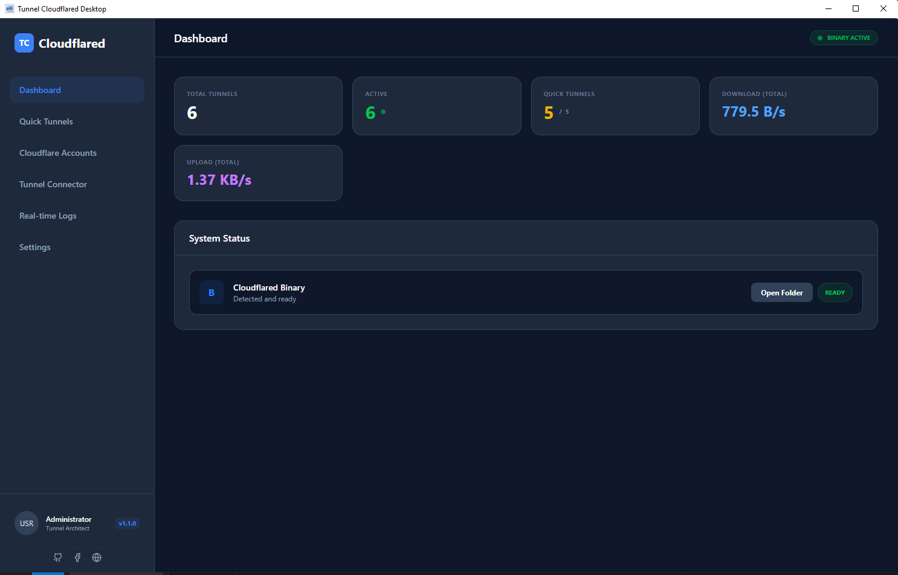
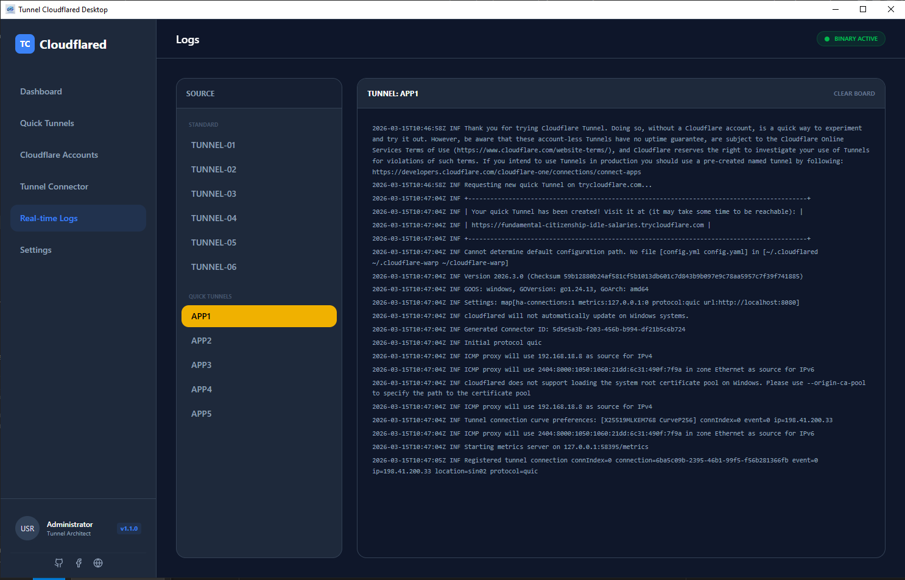
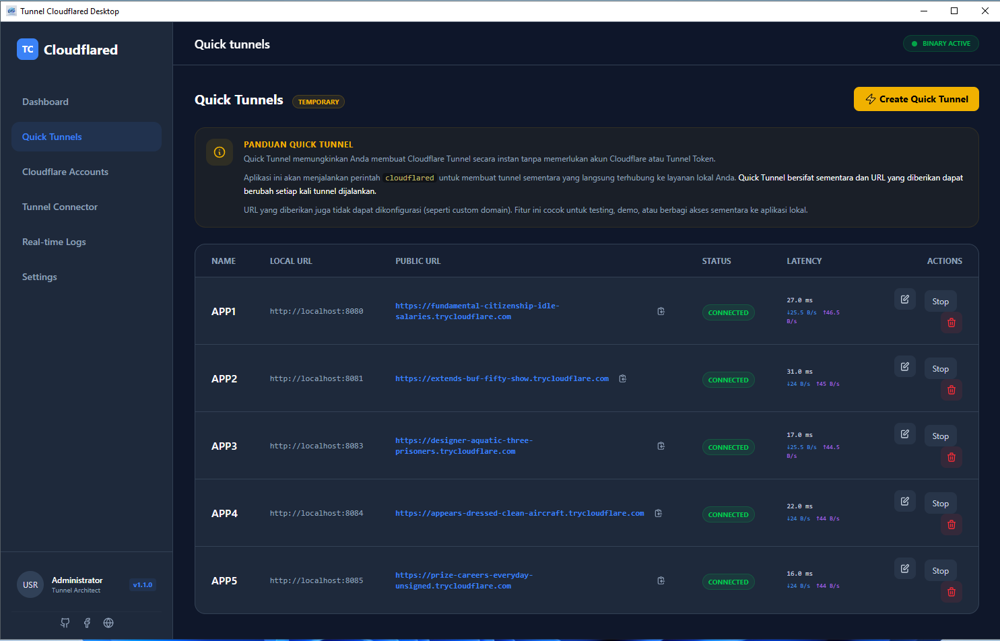
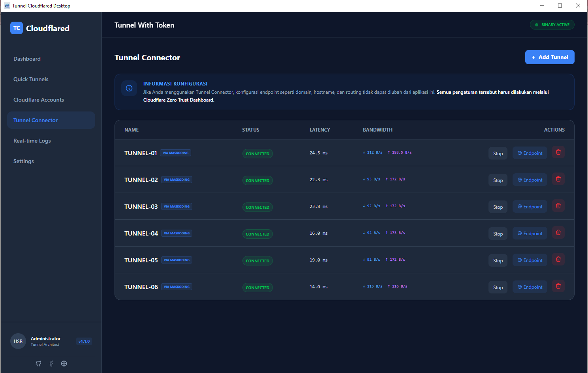
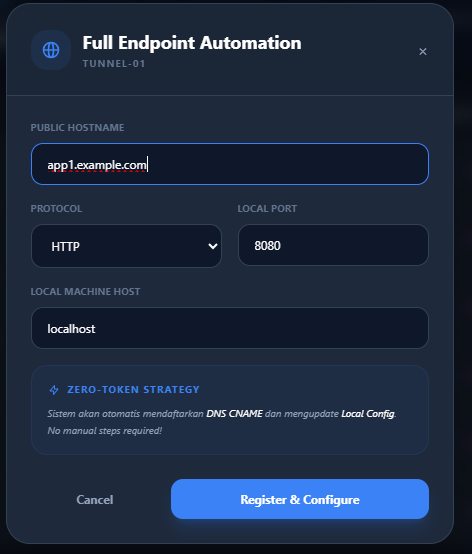
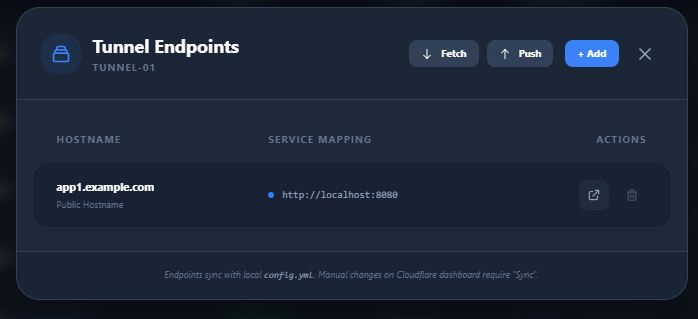
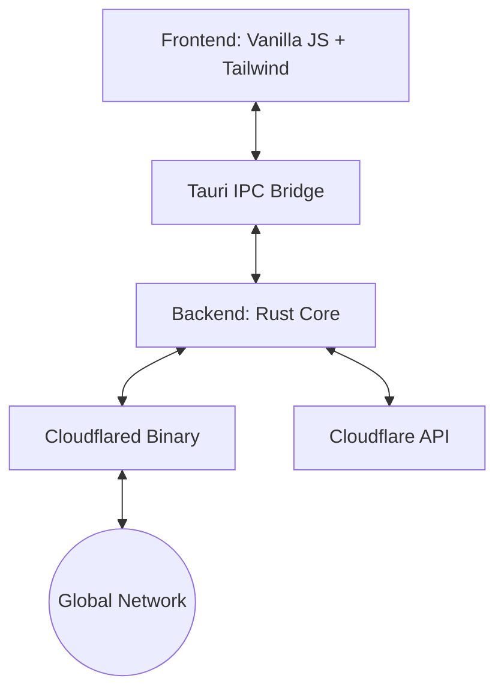

# Tunnel Cloudflared Desktop

A modern, high-performance desktop application for managing Cloudflare Tunnels with ease. Built with **Tauri**, **Rust**, and **Vanilla JavaScript**.

<div align="center">
  
  <h1>Tunnel Cloudflared Desktop</h1>
  <p><i>The secure, lightweight way to expose your local services to the world.</i></p>
</div>

## Features

- 🚀 **One-Click Quick Tunnels**: Create temporary tunnels without a Cloudflare account.
- 🔐 **Multi-Account Management**: Securely manage multiple Cloudflare accounts using `cert.pem`.
- 🔄 **Two-Way Synchronization**: Sync tunnel configurations between your local app and the Cloudflare Dashboard.
- 📊 **Real-time Metrics**: Monitor traffic, latency, and connection status.
- 📜 **Live Logs**: Dedicated terminal view for real-time tunnel output.
- 📦 **Portable EXE**: Standalone binary for easy distribution.
- 🛡️ **Auto-Binary Management**: Automatically detects and downloads the correct `cloudflared` version for your OS.

## Preview

| Dashboard | Logs |
| :---: | :---: |
|  |  |

| Quick Tunnels | Tunnel Connector |
| :---: | :---: |
|  |  |

| Add Endpoint | Tunnel Endpoints |
| :---: | :---: |
|  |  |

## Technical Architecture

The application leverages **Tauri v2** to provide a lightweight security-first alternative to Electron. It uses a bridge between a high-performance Rust backend and a modern Vanilla JS frontend.



### Why Rust & Tauri?
- **Security**: Rust's memory safety prevents common vulnerabilities.
- **Performance**: Near-native speed with minimal RAM footprint (approx. 50-80MB).
- **Size**: Final binary is ~10-15x smaller than equivalent Electron apps.

## Prerequisites

Before you begin, ensure you have the following installed:
- [Node.js](https://nodejs.org/) (v18+)
- [Rust](https://www.rust-lang.org/) (latest stable)
- [WebView2](https://developer.microsoft.com/en-us/microsoft-edge/webview2/) (Included in Windows 10/11)

## Getting Started

### 1. Clone the Repository
```bash
git clone https://github.com/maskodingku/Tunnel-Cloudflared-Desktop.git
cd Tunnel-Cloudflared-Desktop
```

### 2. Install Dependencies
```bash
npm install
```

### 3. Run in Development Mode
```bash
npm run tauri dev
```

### 4. Build Productive Binary
```bash
npm run tauri build
```

## Security & Audit Focus

This project is designed with transparency and security in mind:
- **Zero-Trust**: No tokens are stored in plain text; ingress rules are managed via secure local YAML.
- **Local First**: Your data stays on your machine. API calls are made directly to Cloudflare.
- **Audit Tip**: Check `src-tauri/src/accounts.rs` to see how we securely handle Cloudflare API interactions using local credential parsing.

> [!IMPORTANT]
> Your `cert.pem` and `app_config.json` are automatically ignored by `.gitignore` to prevent accidental credential leaks.

## License
Distributed under the **MIT License**.

## Portfolio
Developed with ❤️ by **[Abdi Syahputra Harahap (MASKODING)](https://www.maskoding.com/)**.
